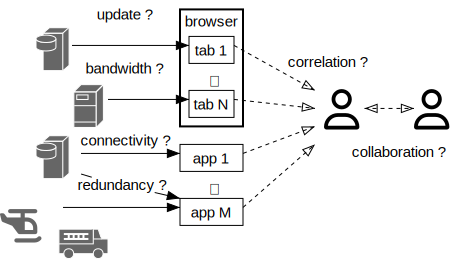
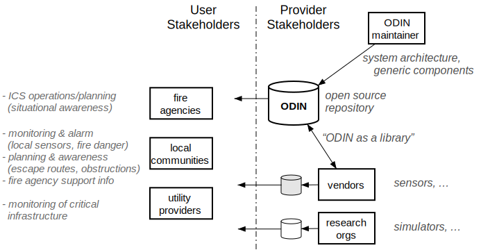
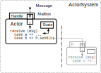
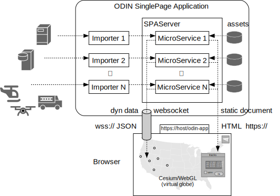
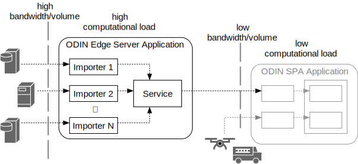
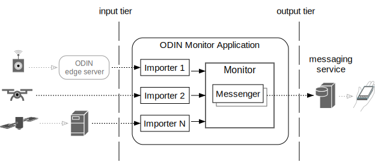

# Introduction

ODIN is a software framework to efficiently create servers that support disaster management. 

More specifically it is a framework to build servers that import and process an open number of external data sources for information such as weather, ground-, aerial- and space-based sensors, threat assessment, simulation, vehicle/crew tracking and many more. The over-arching goal is to improve situational awareness of stakeholders by making more - and more timely - information available in stakeholder-specific applications. The main challenge for this is not the availability of data, it is how this data can be integrated in extensible and customizable applications. 

We want to mitigate the **information fragmentation- and compartmentalization problem**. No more hopping between dozens of browser tabs. No more manual refreshes to stay up-to-date. No more printouts to communicate. No more take-it-or-leave-it systems that can't be extended.

ODINs goal is *not* to create yet another website that is supposed to replace all the ones that already exist. We want to enable stakeholder organizations to assemble *their* server applictions showing the information *they* need, with the capability to run those servers/applications on *their* machines (even out in the field if need be). We also want to do this in a way that makes it easy to integrate new data sources and functions as they become available from government, research organizations and commercial vendors. We want ODIN to be extensible, scalable, portable and - last not least - accessible.

To that end ODIN is open sourced under [Apache v2 license](http://www.apache.org/licenses/LICENSE-2.0). It is a library you can use and extend in your projects. 

## Stakeholders

Our vision for ODIN goes beyond a single stakeholder. We want it to be an open (freely available) platform for both users and developers. The ODIN maintainers are just one part of the puzzle, developing and maintaining the core framework other developers can build on. We only see our role in creating generic components that implement a consistent, extensible and scalable architecture. 

User stakeholders are more than just responder organizations (of which there are many). We also envision local communities who want to improve their level of preparedness / disaster planning. Another example would be utility providers monitoring critical infrastructure. The common goal for such user stakeholders is to enhance their situational awareness but what information that entails depends on the specific incident type, stakeholder and location. 

What holds for most user stakeholder organizations is that they lack the resources to develop respective systems from scratch. The stakeholders who do have development capacity often find themselves reinventing the wheel. The stakeholders who subscribe to commercial services have no way to tailor or extend such services.

There is no single organization that could develop all service components on its own. Commercial vendors come up with new sensors. Research organizations develop new forecast models and simulators. What holds for all such provider stakeholders is that they want to focus on their specific expertise. They don't want to duplicate existing functions just to make their products available. If they do so it just increases the information fragmentation problem we started with.

ODIN aspires to become the common ground on which stakeholders can meet - free, open and extensible for all. 

## Underlying SW Architecture/Design

To be that common basis ODIN needs a strong architectural foundation. Since ODINs main task is to collect and then process data from various independent external sources we need good support for concurrent computation - one of the most challenging topics for software development. ODIN meets this challenge by using the [Actor Programming Model](https://en.wikipedia.org/wiki/Actor_model): asynchronously executing objects which only communicate through messages and don't share internal state (see [odin_actor](odin_actor/odin_actor.md) and [The Actor Programming Model](odin_actor/actor_basics.md) for details). 

ODIN also has to work with existing software. There is a large collection of existing work we want to build on, such as fire-behavior and micro grid wind simulators (e.g. [WindNinja](https://weather.firelab.org/windninja/)) and general geospatial data processing libraries (e.g. [GDAL](https://gdal.org/)). Given the binary nature of many of the underlying data formats, the need to efficiently use 3rd-party native libraries, the challenges of concurrent programming and the portability we strive for we chose [Rust](https://www.rust-lang.org/) as the implementation platform as it gives us

- language intrinsic memory- and thread- safety
- a well defined [Application Binary Interface](https://en.wikipedia.org/wiki/Application_binary_interface)
- a comprehensive cross-platform standard library
- a huge external [eco-system](https://crates.io/)
- good asynchronous programming support, both in the language and its libraries
- powerful abstraction features for large scale program design
- a mature, consistent tool chain (especially including dependency management)
- high efficiency / low system overhead (one of Rusts design goals is "zero cost abstraction")

What do we want to build on that basis? 

## ODIN Application Types

While ODIN contains all sort of command line tools, the primary targets are three types of applications:

- user servers - providing data visualization for end users
- edge servers - factoring out network-, compute- and data volume-intense tasks to dedicated machinery 
- monitors - listening on sensor data and potentially sending out alarm notifications

All are built from the same ODIN components and follow the same architectural design outlined above.

### User Servers

ODIN user servers are not supposed to handle millions of requests from large numbers of simultaneous but isolated users. The servers we mainly target support medium size workgroups of stakeholder users (<1000) with the need for:

- automatic data update (also for low latency tracking data)
- collaboration (synchronized views)
 
The main application model for user servers is a [Single Page Application](https://en.wikipedia.org/wiki/Single-page_application). The main user interface is a web browser - ODIN does not require end user installation and can be used on existing machinery.

A Single Page Application (SPA) mainly uses two types of actors: importers and a SPAServer. An Importer is a dedicated component to handle a single external data source, including data retrieval schedule and translation into ODIN internal format (if required). Importers are completely independent of each other which makes it simple to add new ones. Their results are sent via messages to a SPA-Server actor that distributes the information to connected users. 

The SPA-Server actor utilizes MicroService objects that are managing static and dynamic content which is shown as separate layers on the served web page. Static content mostly consists of HTML and associated Javascript modules. It can be initialized from files or compiled into stand-alone executables and is served via http(s) protocol. 

Stand alone ODIN SPA servers do not require any additional files/installation other than the executable itself (see [odin_build](odin_build/odin_build.md) for details). They can be thought of as traditional desktop applications that just use a browser as the user interface.

To ensure realtime update of low latency data (down to 1Hz) such as tracked objects ODIN utilizes [WebSockets](https://en.wikipedia.org/wiki/WebSocket) that are managed by the MicroService objects, and processed in the browser by ODINs Javascript modules (assets).

For geospatial display in the browser ODIN uses the open source [CesiumJS](https://cesium.com/platform/cesiumjs/) library, which is built on top of [WebGL](https://en.wikipedia.org/wiki/WebGL) and hence supports hardware accelerated 3D graphics to display a virtual globe.

ODINs user interface components such as (movable) windows, lists and buttons are implemented with ODINs own Javascript library that resembles a traditional desktop and is highly (user-) configurable.

### Edge Servers

ODIN edge servers are the means to make ODIN applications scalable - they provide condensed/consolidated input data for user servers by factoring out high computational workloads and/or large input data volumes into dedicated machines with high speed network access. Edge servers are primarily used to reduce downstream processing and data volume.

Assume for instance micro-grid (location/terrain- aware) wind forecast for a given incident area, such as provided by [WindNinja](https://weather.firelab.org/windninja/). This not only requires high speed machinery to execute the simulation but also needs significant bandwidth/connectivity to periodically obtain the required input data such as weather forecasts and station reports, high resolution digital elevation models, vegetation/fuel models and more. The user-facing results of the simulation can be compiled into relatively simple text (CSV) files containing a wind vector grid in the area of interest. 

As a general rule we want to be able to run functions where the data is most easily accessible. For information that is obtained from sensors in the field (such as local tracking data) that can be a local incident command server. For functions that use large amounts of input such as NOAA weather forecasts this can be a high speed data center. For functions that are computationally expensive this should be a super computer.

### Monitors

This class of applications mostly automates alarm notifications by monitoring sensor input to detect critical conditions, vetting them by sensor data post-processsing or retrieval of supporting evidence, eliminating duplicates, and then sending out notifications via 3rd party notification channels such as text messages or [Slack](https://slack.com/) channels.

Sensor input can be obtained from directly connected devices or from own or external edge servers. 

Monitors can combine/correlate different sensor systems (e.g. ground based and satellite sensors). 

## Examples

To get an idea of what ODIN servers might look like on end user machines we refer to two of our TFRSAC talks:

  * [spring 2023](https://www.youtube.com/watch?v=b9DfMBYCe-s&t=4950s)
  * [fall 2022](https://www.youtube.com/watch?v=gCBXOaybDLA)

