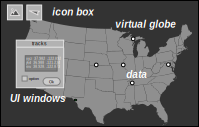
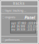

# ODIN Web Client/Server Interaction

The `SpaServer` and its `SpaServices` are only half of the story. Since they serve (static and dynamic) data
we still need to visualize and control the data on user machines. To avoid the need for any end-user install we
use standard HTTP, HTML, Javascript and JSON messages over websockets for this purpose.

While `SpaServer` and `SpaService` are generic and can be used for many different web pages/applications the
main end-user visualization we target is a single web page showing geospatial data in application specific layers. 



The four items within this UI are:

- icon box
- UI windows (with UI components)
- virtual globe
- data entities

The icon box contains icons that launch associated UI windows. There is an icon/window pair for each data layer
that can be displayed, plus some pairs for general functions such as clocks, settings and layer control.



The UI windows serve a dual purpose: they can be used for alphanumeric display of data and they hold user interface
components to control what data is displayed and how it is rendered. UI windows normally contain vertically stacked, 
expandable *panels* for different functional areas within the layer. Panels hold related *UI components*

The windows are shown on top of a 3D virtual globe background that uses WebGL to render both static maps and
dynamic data entities such as track symbols or weather information. Data entities are geometric constructs
such as points, lines and polygons, or symbols/icons representing data items.


### 3.1 DOM

The underlying DOM is assembled by `odin_server::SpaComponents::to_html()` based on the components that were collected
from each of the configured `SpaService` implementations of the application. It has the following structure:

```html
<html>
    <head>
        <!-- collected head fragments  -->
        <link rel="stylesheet" type="text/css" href="./asset/odin_server/ui.css"/>>
        <script type="module" src="./asset/odin_server/main.js"></script>
        <script type="module" src="./asset/odin_goesr/odin_goesr.js"></script>
        ...
    </head>

    <body>
        <!-- collected body fragments  -->
        <div id="cesiumContainer" class="ui_full_window"></div>
        ...

        <!-- post init script  -->
        <script type="module">
            import * as main from './asset/odin_server/main.js';
            if (main.postInitialize) { main.postInitialize(); }
            import * as odin_goesr from './asset/odin_goesr/odin_goesr.js';
            if (odin_goesr.postInitialize) { odin_goesr.postInitialize(); }
            ...
        </script>
    </body>
</html>
```

Head fragments can contain link elements (for CSS) and script elements (for JS scripts and modules). 
This is collected from the `SpaService::add_components()` implementations of the configured services.
`SpaServices` normally have an associated JS module, stored in the `asset/` dir of the containing crate, e.g

```
    odin_goesr/
      assets/
         odin_goesr_config.js       optional, if there is static config of odin_goesr.js
         odin_goesr.js              the JS module associated with the SpaService
      src/      ⬆︎         
         goesr_service.rs           the SpaService implementation that adds odin_goesr.js to the document
```

The first included JS module is always the automatically added `main.js`, which is provided as an asset by the 
`odin_server` crate, there is no need to add it to `add_dependencies()` implementations of `SpaServices`. Its 
main purpose is to define types and access APIs for data that can be shared between Javascript modules and users
(e.g. `GeoPoint`). 

Please note `main.js` module only provides a local storing mechanism, i.e. if no other `SpaService` such as 
[`odin_share`](../odin_share/odin_share.md)`::ShareService` is configured it will only allow to share data between micro 
services (layers) running within the same browser document.

The document construction ensures that each configured JS module is loaded just once in the order of first reference as 
odin-rs modules normally depend on each other (specified by their `SpaService::add_dependencies()` implementation).

Body fragments are not restricted and can contain whatever HTML elements are required by their `SpaServices`.

Following the body fragment section is a script that calls `postInitialize()` of each loaded JS module that contains
such a function. This is used for code that has to run after all modules have been initialized. Modules
might be async and hence we cannot rely on their static order to guarantee completed initializatin.

If `SpaService` impls do have dependencies and components such as JS modules those have to be
specified in the `SpaService` trait function, as shown in the `GoesrService` example below:

```rust
#[async_trait]
impl SpaService for GoesrService {

    fn add_dependencies (&self, spa_builder: SpaServiceList) -> SpaServiceList {
        spa_builder.add( build_service!( => CesiumService::new())) // recursive dependency graph
        ...
    }

    fn add_components (&self, spa: &mut SpaComponents) -> OdinServerResult<()>  {
        spa.add_assets( self_crate!(), load_asset);          // all icons and other resources used by JS module
        spa.add_module( asset_uri!("odin_goesr_config.js")); // module with static config
        spa.add_module( asset_uri!( "odin_goesr.js" ));      // service specific JS module itself
        ...
        Ok(())
    }
    ...
}
```


### 3.2 Client (Browser) Code

Although there is no need for a specific structure or purpose of a JS module the ones implementing UI windows
and websocket message processing follow the convention laid out in the `odin_goesr.js` example below:

```javascript

//--- 1. import JS module configuration
import { config } from "./odin_goesr_config.js";              // associated static config for this module

//--- 2. import other JS modules
import * as main from "../odin_server/main.js";               // global functions (e.g. for data sharing)
import * as util from "../odin_server/ui_util.js";            // common, cross-module support functions
import * as ui from "../odin_server/ui.js";                   // ODIN specific user interface library 
import * as ws from "../odin_server/ws.js";                   // websocket processing
import * as odinCesium from "../odin_cesium/odin_cesium.js";  // virtual globe rendering interface from odin_cesium
... 

//--- 3. constants
const MOD_PATH = "odin_goesr::goesr_service::GoesrService";   // the name of the associated odin-rs SpaService 
...

//--- 4. registering JS message handlers
ws.addWsHandler( MOD_PATH, handleWsMessages);                 // incoming websocket messages for MOD_PATH
main.addShareHandler( handleShareMessage);                    // if module uses shared data items
main.addSyncHandler( handleSyncMessage);                      // if module supports synchronization commands

//--- 5. data type definitions, module variable initialization
...
var dataSets = [];                                            // module data
var dataSetView = undefined;                                  // module global UI components
var selectedDataSet = undefined;                              // keeping track of user selections
...

//--- 6. UI initialization
createIcon();
createWindow();                                               // UI window definition
initDataSetView();                                            // initialize UI window components and store references
...

console.log("ui_cesium_goesr initialized");

//--- 7. function definitions
...
function createIcon() {                                       // define UI window icon (used to automatically populate icon box)
    return ui.Icon("./asset/odin_goesr/geo-sat-icon.svg", (e)=> ui.toggleWindow(e,'goesr'));
}

function createWindow() {                                     // define UI window structure and layout
    return ui.Window("GOES-R Satellites", "goesr", "./asset/odin_goesr/geo-sat-icon.svg")(
        ui.LayerPanel("goesr", toggleShowGoesr),              // panel with module information (should be first)
        ...
        ui.Panel("data sets", true)(                          // (collapsible) panel definition
            ui.RowContainer()(
                ui.CheckBox("lock step", ...),
                ...
                (dataSetView = ui.List("goesr.dataSets", 6, selectGoesrDataSet)),
                ...
            )
        ),
        ...
        ui.Panel("layer parameters", false)(                 // panel with display parameter controls (should be last)
            ui.Slider("size [pix]", "goesr.pointSize", ...)
            ...
        )
    );
}

function initDataSetView() {                                 // UI component init 
    let view = ui.getList("goesr.dataSets");
    if (view) {
        ui.setListItemDisplayColumns(view, ["fit", "header"], [    // defines List columns and display
            { name: "sat", tip: "name of satellite", width: "3rem", attrs: [], map: e => e.sat.name },
            { name: "good", tip: "number of good pixels", width: "3rem", attrs: ["fixed", "alignRight"], map: e => e.nGood },
            ...
        ])
    }
}

function selectGoesrDataSet(event) {                         // UI component callback
    let ds = event.detail.curSelection;
    if (ds) {
        selectedDataSet = ds;                                // update selected items
        ...
    }
}

function handleWsMessages(msgType, msg) {
    switch (msgType) {
        case "hotspots": handleGoesrDataSet(msg); break;
        ...
    }
}

function handleGoesrDataSet (hotspots) {
    ...
    dataSets.push( hotspots);                                // update data
    ui.setListItems( dataSetView, displayDataSets);          // update UI components displaying data
    ...
}

function handleShareMessage (msg) {                          // shared data updates (local and between users)
    if (msg.setShared) {
        let sharedItem = msg.setShared; ...
    }
    ...
}

function handleSyncMessage (msg) {                           // user interface sync (between users)
    if (msg.updateCamera) { ... }
}
...                                                          // more module functions


//--- 8. global post JS module initialization
export function postInitialize() {                            // optional but needs to be named 'postInitialize`  
    ...
}
```

Not all JS modules need all these sections. All functions (except postInitialize) are module private and can be named
at will, although we encourage to use above conventions so that modules are more easy to read.

If a module requires static initialization that can change independently of the code this should go into a separate
`<module-name>_config.js` asset that is kept either outside the repository in the `ODIN_ROOT/asset/` directory tree or
(if it has sensible non-application specific defaults) in the respective `assets/` directory of the crate that provides
the service. Although there can be some code (and even imports) config modules should be restricted to exporting a 
single `config` object like so:

```javascript
export const config = {
    layer: {
      name: "/fire/detection/GOES-R",
      description: "GOES-R ABI Fire / Hotspot Characterization",
    },
    pointSize: 5,
    ...
}
```

The functions and UI components used by JS modules are from ODIN's own [`odin_server/assets/ui.js`](odin_server/ui_library.md) library. 
The main reason why we use our own is that most available 3rd party libraries are meant to be for full web pages whereas we
use UI components in floating windows on top of our main display - the virtual globe. This means we have to minimize screen
space for UI components. See [design principles](design_principles.md) for other reasons. 


### 3.3 WebSocket Message Processing

This leaves us the (bi-directional) processing of websocket messages, which is not hard-coded but implemented as a `SpaService` /
JS module pair itself: `odin_server::WsService` and `odin_server/assets/ws.js`.

As a general principle we only exchange JSON messages over the websocket. Each message uses the following JSON format:

```
    { "mod": "<service name>", "<msg-name>": <payload value> }
```

(e.g. `{ "mod": "odin_goesr::GoesrService", "hotspots": [...] }` in the above example). The `mod` field is used on both the
server- and the client-side to filter/route it to its respective service/JS module, i.e. it effectively creates a service
specific namespace for messages. 


#### 3.3.1 `SpaService` websocket handling 

On the server side this entails a `SpaService::handle_ws_msg(..)` implementation for incoming messages (sent by the JS module):

```rust
impl SpaService for MyService {
    ...
    async fn handle_ws_msg (&mut self, 
        hself: &ActorHandle<SpaServerMsg>, remote_addr: &SocketAddr, ws_msg_parts: &WsMsgParts) -> OdinServerResult<WsMsgReaction> 
    {
        if ws_msg_parts.mod_path == ShareService::mod_path() {
            match ws_msg_parts.msg_type {
                "myMessage" => ...
                ...
            }
        }
    }
}
```

The `WsMsgParts` is a helper type that already breaks out the `mod_path`, `msg_type` and `payload` string slices of the incoming
message text.

Sending messages from the service to the client has to go through the `SpaServer`, i.e. is done by sending any one of the 
following actor messages to it:

- `BroadcastWsMsg` sends a websocket message to all currently connected (browser) clients
- `SendAllOthersWsMsg` sends to all but one (usually the sender client) websocket connection
- `SendGroupWsMsg` sends to a explicitly provided set of websocket connections
- `SendWsMsg` sends only to one explicitly specified websocket connection

Each of these types store the websocket message as a generic `String` field, i.e. the message can be assembled manually. To
avoid mistakes and cut boiler plate code we provide a 

```rust
pub struct WsMsg<T>  {
    pub mod_path: &'static str, // this is composed of crate_name/js_module (e.g. "odin_cesium/odin_cesium.js")
    pub msg_type: &'static str, // the operation on the payload
    pub payload: T
}
```

helper construct for serialization that can be used like so:

```rust
   let msg = WsMsg::json(ShareService::mod_path(), "myMessage", payload)?;
   hserver.send_msg( BroadcastWsMsg{ data: msg}).await;
```

The payload serialization/deserialization is usually done by means of the [`serde_json`](https://docs.rs/serde_json/latest/serde_json/) crate.


#### 3.3.2 JS module websocket processing

On the client (browser) side websocket messages come in through the `odin_server/assets/ws.js` JS module (if `odin_server::WsService` is used),
which is responsible for dispatching the message to the JS module that registered for the `mod` property of the message object. 

JS module websocket handlers are functions that take two arguments - the name of the message (a string) and the Javascript object
that is deserialized from the payload value: 

```javascript
   function myHandler (msgTypeName, msgObj) {..}
```
This means deserialization if automatically done in ws.js - the receiving JS module does not have to call `JSON.parse(..)`.

The JS module recipient has to provide the message handler function and register it like so:

```javascript
...
import * as ws from "../odin_server/ws.js";                  
...
const MOD_PATH = "odin_goesr::goesr_service::GoesrService";   // the type name of the corresponding SpaService implementation
...
ws.addWsHandler( MOD_PATH, handleWsMessages);
...
function handleWsMessages(msgType, msgObj) {
    switch (msgType) {
        case "hotspots": ...; break;
    }
}
```

#### 3.3.3 main.js - shared types and operations

The automatically included `main.js` module defines types and APIs for values that can be shared between JS modules (and potentially
with other users if a service such as [`odin_share::ShareService`](../odin_share/odin_share.md) is included in the application). 

JS modules using this functionality have to add a respective import:

```javascript
...
import * as main from "../odin_server/main.js";
...
 ...main.getSharedItem(key)...
```

The shared types are 

- `GeoPoint` and `GeoPoint3` for 2- and 3-dimensional geographic coordinates
- `GeoLine` and `GeoLineString` for geographic polylines
- `LineString3` for [ECEF](https://en.wikipedia.org/wiki/Earth-centered,_Earth-fixed_coordinate_system) (xyz) trajectories
- `GeoRect` for parallel/meridian aligned rectangles of geographic coordinates
- `GeoPolygon` for general geographic coordinate polygons
- `GeoCircle` and `GeoCylinder` for geographic circles and cylinders
- `String` for text data
- `I64` and `F64` for numeric integer and float values
- `Json` for text data that is supposed to be parsed as [JSON](https://en.wikipedia.org/wiki/JSON), i.e. is a 
  "catch-all" format for arbitrary objects

Each of these types has a respective type name constant (e.g. `GEO_LINE`) that can be used to identify the type.

Instances of these types can be shared locally or globally, and are identified through an associated pathname (path elements
separated by '/'). The basic abstraction for this is the `SharedItem(key,isLocal,value)`. Shared values can be further
annotated by having a `comment` and an `owner`.

The abstract storage model for shared items is a general key/value store, i.e. `SharedItems` are identified through their
respective keys (pathnames). 

The main API to access shared items is

- `getSharedItem (key)` - to get a specific shared item with known key
- `getAllMatchingSharedItems (regex)` - to get a set of shared items through key patterns
- `setSharedItem (key, valType, data, isLocal=false, comment=null)` - to create, store and share a value
- `removeSharedItem(key)` - to purge a shared value from the store

Changes to the shared item store are broadcasted to registered listeners, i.e. if a JS module needs to know of such
changes it has to register:

```javascript
...
main.addShareHandler( handleShareMessage);
...
function handleShareMessage (msg) {
    if (msg.SHARE_INITIALIZED) {...} 
    else if (msg.setShared) {...}
    else if (msg.removeShared) {...}
}
```

The sharing mechanism can also be used to synchronize operations such as view changes between users. This is done through
`addSyncHandler( handleSyncMessage)` registration, respective `handleSyncMessage` handlers implementations and
`publichCmd(cmd)` calls for relevant state changes. Since those only make sense / have an effect in a context of a
remote service such as `ShareService` please refer to details in [`odin_share`](../odin_share/odin_share.md).

`main.js` also includes a `addShareEditor (dataType, label, editorFunc)` function that can be used by JS modules to 
register interactove editors for share types such as 'GeoLineString` but this is more of a specialty.

Apart from providing the basic sharing API and types `main.js` can also be used to define document global data through its
`exportFunctionToMain(f)` and `exportObjectToMain(o)` functions, which make their arguments globally available in the DOM
as `window.main.<name>`.